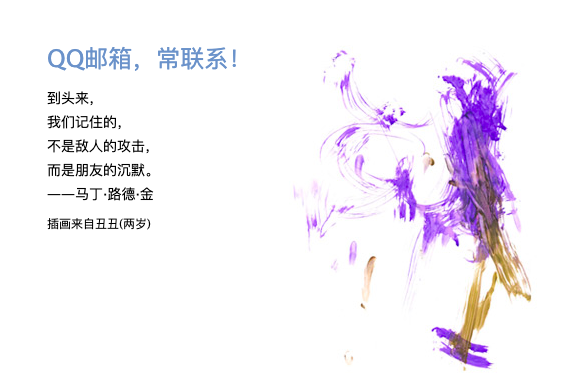

# 从定位理论谈程序员的职业发展规划


你好，我是云哥。

有个问题我最近一直在思考：一个普通的程序员，如何让自己的能力和价值被市场看到和认可？

我相信这个问题也是许许多多的程序猿和程序媛们思考过和正在思考的问题。

2020年读过的一本品牌营销相关的书籍，艾·里斯与杰克·特劳特《定位》中的许多观点对我有不少的启发。

这里将我整理后的一些认知和大家分享。


### 一，什么是定位？


何为定位？定位就是让一个产品在潜在客户心智中占据一个有价值的地位。

这个产品可能是一种商品、一项服务、一个机构甚至是一个人，也许就是你自己。

定位的关键是什么呢？我们来听一个故事。

有个旅游者行李被偷了，现在身无分文，幸好他手上还戴着一块名贵的劳力士手表。于是他就站在路边向来来往往的游客兜售这块手表，结果他悲伤的发现，自己花了2万美元买来的劳力士手表，现在叫200美元也卖不出去。

为什么游客不愿意买？因为旅客不相信这块手表是真的劳力士。显然，决定顾客买不买的关键因素，不在于这块手表事实上是真还是假，而在于顾客认为它是真还是假。这就是定位理论所说的认知大于事实。

因此，定位中最关键的实际上是潜在客户的心智模式，它甚至超过了产品本身的真实价值。

许多时候，我们会面临着和上面像来往游客兜售劳力士手表的旅客类似的尴尬境地。为什么我才高八斗，却只有月薪三千？为什么我腹肌八块，却还是光棍一条？为什么知道了那么多道理，却还是过不好这一生？

从一定意义上说，这些都是因为定位失败导致的悲剧。
 

```python

```

### 二，为何需要定位？

<!-- #region -->
经济学中有一个观点叫做交易产生价值，而不是生产产生价值。

而交易的产生，只有潜在客户愿意为他心中的价值而买单的情况下才能发生。

因此，定位是否成功，产品是否能在潜在客户心智中占据一个有价值的地位决定了产品是否能够真正产生交易价值。

但定位成功是很难的。原因主要有三。


**1，人们面临着过度传播的信息。** 

简单的说，人们拥有太多的选择。

无论人们是在虚拟世界中玩游戏刷视频，还是在真实世界中逛街乘地铁，铺天盖地的广告拥堵着人们的感官通道。

它们会在不经意的每个角落出现，像幽灵一样，像鬼魅一样。人们早已习惯了对绝大部分广告熟视无睹充耳不闻。

因此，绝大部分广告很难进入人们的心智。

当人们决定要购买一件商品时，每一种商品都有几十上百种品牌类别。以汽车为例，国内的汽车品牌有超过100种之多，

除了一些我听说过的大众，本田，吉利，现代，还有许多我从来都没有听过名字的品牌，什么奥迪，宝马，奔驰。

作为一名普通的消费者，我几乎不可能去买一个我从来都没有听说过名字的品牌的汽车。

因此，绝大部分商品很难进入潜在客户的心智。


**2，人们只能理解简单的东西。**

简单的说，人们的认知水平非常有限。

如果你告诉人们这是一辆4门5座的三厢轿车，最高车速为225km/h，发动机最大功率达到202KW，车身长4694mm、宽1850mm、高1443mm。人们通常是懵逼的。

但如果你告诉人们这是一辆特斯拉Model3电动汽车，价格26万。人们会说：哇哦，好酷！

如果你告诉人们这是一个从事自然语言处理方向研究的程序员，他有8年NLP研究经验，精通NLP领域知识，包括文本分类、信息抽取、文本生成。熟练掌握常见NLP开发框架，例如StanfordNLP，NLTK，RASA，熟练使用TensorFlow，Keras，PyTorch等深度学习开源框架。人们通常是懵逼的。

但如果你告诉人们这是一个阿里的NLP方向的P9专家，年薪数百万。人们会说：哇哦，大佬！

因此，大部分信息都超出了普通人的认知范围，人们通常只能理解一些感性化和标签化的信息。信息越简单传播越有效。


**3，人们的心智模式很难改变。**

简单的说，人们很难改变已经形成的观念。尤其是难以改变负面的观念。

如果一个品牌给人留下了廉价低端的印象，那么无论它再如何出高端产品，用户都是不会买单的。除非作充分的切割，出一个新品牌才有可能成功。

心智模式有自我验证效应的特点，它会进行自我强化。

有个段子特别能说明这一点。说某男爱上了一个女生，掏心掏肺花光了所有积蓄，朋友知道后就劝他：她根本就不爱你，她喜欢的只是你的钱。某男反问一句：那她为什么只喜欢我的钱，而不喜欢别人的钱呢，还不是因为她喜欢我吗？

正如俗话所说，能够改变自己的是神，总想着改变别人的是神经病。

因此，大部分试图改变人们观念的努力都是徒劳的，人们的心智模式很难被改变。


<!-- #endregion -->

```python

```

### 三，如何进行定位？

<!-- #region -->
定位尽管艰难，但是有一些策略和努力方向被证明是有效的。

**1，第一定位法**

成为行业第一，这是最强的定位策略。

人们天然对某个品类的第一名印象深刻，它常常会作为这个品类概念的外延例子和这个品类概念的内涵一同被人们认识。

世界上最高的山峰是什么？绝大部分人都能够脱口而出：珠穆朗玛峰。那么，世界上第二高的山峰是什么呢？部分人知道是乔戈里峰。那么，世界上第三高的山峰是什么呢？少数人知道是干城章嘉峰。那么，世界上第十高峰是什么呢？几乎没有人知道，谁在乎呢？

对于产品来说，占据细分领域市场头部的品牌天生自带流量。一说到可乐，我们会想到可口可乐，一说到空调，我们会想到格力空调。一说到外卖，我们会想到美团外卖。一说到短视频，我们会说抖音短视频。


在许多互联网细分领域中，存在着所谓的"七二一格局"：即一个行业演化到最后，行业第一的品牌占据着大约70%的市场份额，行业第二的占据着大约20%的市场份额，其余的品牌占据着大约10%的市场份额。像国内的电商，外卖，搜索，游戏等领域都呈现出类似的市场格局。

如果不能成为第一吃肉，那么至少要努力成为第二喝汤，否则就只能喝白开水了。


**2，关联定位法**

和人们熟悉的高价值的事物建立强的关联，这是非常强的定位策略。

非常著名的例子是莱特币。比特币是第一个区块链数字货币，其基于计算量证明实现的去中心化的公共账本即区块链技术是一个巨大的技术创新。而莱特币基于比特币进行改进的一种区块链货币，除了更改了一些参数外，本质上没有任何技术创新。

但是莱特币的创始人李启威说了一句非常有水平的话：如果说比特币是数字货币中的金币，那么莱特币就是数字货币中的银币。

据说正是这样一句傻瓜都能听懂的话，在币圈广泛传播，一举奠定了莱特币在数字货币市场上的江湖地位。


**3，特性定位法**

强调产品的独有特性，抓住特定倾向需要的潜在客户，这是非常有效的定位策略。

七八十年代许多汽车厂商都迎合市场需求生产越来越大的SUV汽车，但是德国大众反其道而行之，创造了小型车品牌，大众给小型车的广告词是:think small（往小里想）。这种小型车满足了一些家庭成员较少，希望省油的家庭的偏好，让大众的甲壳虫和高尔夫站上美国销量冠军。

随后，大众开始要做大型车辉腾，think big（往大里想），之后开始销量被丰田反超，2016年，大众宣布停产大型车辉腾。

真是一个有意思的事情，大众往小里想的思维让它变大了，大众往大里想的思维让它变小了。


**4，名字定位法**

名字就像钩子，把品牌挂在潜在顾客心智中的产品阶梯上。 给产品取一个什么名字，是非常重要的营销决策。

一个无力的、毫无意义的名字难以进入人们的心智，你必须起一个能启动定位程序的名字，一个能告诉潜在客户该产品主要特点的名字。

位于加勒比海上的猪岛在改名为天堂岛之前一直默默无闻。中国云南省的中甸县在改名为香格里拉之后成为了文青们趋之若鹜的旅游胜地。

元气森林，妙可蓝多是2020年异军突起的两个食品类品牌，作为一家生产饮料的创业公司，元气森林的估值过140亿人民币，而作为一家国内的生产奶酪的食品公司，妙可蓝多的市值超过270亿人民币。元气森林，妙可蓝多这两个名字给人以年轻活力的想象，非常二次元，应该是这两个品牌成功的重要原因之一。


**5，故事定位法**

人们不喜欢广告，但人们通常不会拒绝听一个有趣的故事。将产品形象放入到在一个动人的故事中，是非常高超的定位策略。

可以感受一下999感冒灵的故事广告，非常的走心。

《这个世界，总有人偷偷爱着你》


一个女孩，在深夜网络论坛上提了一个问题："手上的动脉在哪里，越具体越好？"
过了会儿她陆续收到了几个回复。

“小可爱，你的动脉被我藏起来了，你笑一下我就给你看^_^”

"买瓶脉动倒过来念就好了，傻瓜，比动脉好玩的事情多着呢，你是不是不开心了，我煮完粥给你吃吧，我煮的粥可好吃了。"

“这个你不用知道呀，医生知道就好了，我们爱你”

"在我心里呀"

https://haokan.baidu.com/v?vid=13869715618365676250&pd=bjh&fr=bjhauthor&type=video


<!-- #endregion -->

### 四，程序员如何自我定位？

<!-- #region -->
回到我们开始的问题：一个普通的程序员，如何让自己的能力和价值被市场看到和认可？

当然，这个问题的前提是这个程序员需要具备扎实的基本功，能够解决关键问题，做出出色产品。

作为某些人眼中的“代码工具人”、“人形编码机”，从功能角度来看, 程序员本身也可以作为一个产品。

一些普通产品的定位策略也适合于程序员的自我定位。


**1，第一定位法**

做出行业第一或者众所周知的产品，毫无疑问是一个程序员最强的定位策略。

最广为人知的那些程序员，无一例外是借助于其惊世作品而成为传奇。


国外的例子诸如：

Linus Torvalds，众所周知的Linux之父，同时也是git版本管理系统的创造者。也是目前Github全球关注用户数量最多的开发者。

Jeff Dean，大名鼎鼎的MapReduce和BigTable的发明者，同时也是TensorFlow的重要创始人。

Guido Van Rossum，龟叔，Python之父。

François Chollet，Keras之父。《Python深度学习》一书作者。


国内的例子诸如：

求伯君，WPS之父。有“中国第一程序员“之称。

张小龙，Foxmail创始人，微信之父。有"中国第一产品经理"之称。

何恺明，ResNet和Faster-RCNN的主要作者。

尤雨溪，前端Vue.js框架的作者，独立开源开发者。也是目前Github中国区关注用户数量最多的开发者。


对于普通的程序员，也许没有机会做出像以上这些大佬们那样惊世的作品。但可以通过努力做出一些不平凡的作品。

例如，发一篇高水平的论文，申一个有含金量的专利，著一本有传播力的书籍，拿一个有挑战性的比赛名次。


**2，关联定位法**

和专业业务相关的高价值事物建立强的关联，是一个程序员非常强的定位策略。

重点学校的学习经历，知名学者的师承关系，龙头企业的工作履历，都是程序员非常加分的关联定位策略。

据说坊间流传着一套普通程序员职场进阶的武功秘笈。

step1:  在小厂一个特定领域方向工作一年以上，掌握基本专业技能。

step2:  平薪或降薪跳槽到知名大厂同领域方向岗位，工作3年以上，努力获得较高职级。

step3:  跳槽到小厂同领域方向岗位，薪资翻倍带团队。


**3，特性定位法**

拥有市场稀缺的行业背景特性或者技术栈特性，这是一个程序员非常有效的定位策略。

对于初入职场的程序员和经验资深的程序员，在自身特性选择上可能会有很大的不同。

对于初入职场的程序员，更加重要的是其技术栈特性。如果能够快速学习，掌握市场稀缺的技术栈，在供不应求的市场背景下，容易获得较好的职业机会。

例如在2013的时候，国内会IOS开发的程序员很容易找到工作机会，在2015年的时候，国内会hadoop开发的程序员被各个互联网公司争相抢夺，在2017年会搞搞Python机器学习的程序员备受青睐，在2019年的时候，到处都在招推荐算法工程师。

而对于经验资深的程序员，更加重要的则是其行业背景特性。长期专注深耕于某个细分行业领域，具有完整的行业业务视野和一定的技术深度，并结识丰富的行业人脉资源，就是其最具价值的特性。一般来说技术管理岗位，都倾向于招聘这种具有长期行业背景经验的程序员，哪怕他们的许多经验已经过时了。


**4，名字定位法**

给自己取一个什么网名，是一个写博客的程序员非常重要的营销决策。

让我来捋一捋那些年让我印象深刻的程序员博客ID吧。

* 轮子哥vczh

* 莫烦Python

* 代码家

* Python小例子

* 王的机器

* 算法美食屋


**5，故事定位法**

伙食最好的那些程序员，不一定是最会写代码的程序员，但一定是有故事的程序员。要么是他们自己擅长讲故事，要么是别人喜欢讲他们的故事。

张小龙曾经是一个会写代码但不会讲故事的程序员，浑身散发着理工男的土木气质。1997年，在数十个夜深人静的夜晚，在弥漫着一圈又一圈香烟的小黑屋中，张小龙以一人之力打磨出了免费软件Foxmail邮箱，并快速获得了超过200万用户，还被《互联网周刊》评为”1998年十大网络工具软件”。然而，彼时的张小龙执着于打磨产品，他拒绝通过广告等方式从Foxmail中盈利，生活十分落魄，甚至一度想将Foxmail以15万元的价格卖给雷军的金山公司。2000年3月，人民日报刊登文章《免费软件，饿着肚子挥洒冲动》说：张小龙，是百万电脑后面藏着的"悲剧人物"，是一个可怜人。

!

张小龙成为了一个有故事的程序员，故事的名字叫做：互联网浪潮里的悲剧。不久之后，张小龙的伙食陡然就变好了。Foxmail以1200万元被博大公司收购，张小龙被任命为博大公司的CTO。但是他却感到有些后悔：“我写了十年程序，第一次，我为我对自己的一个作品的不再拥有有如此强大的失落。失去才知道宝贵。这个时候，我才明白它在我心目中的地位原来是这么地重要。Foxmail的80%是在夜深人静的时候完成的。我只想将它雕塑成一件艺术品。”



2005年，Foxmail和张小龙一起被博大卖给了腾讯。张小龙也慢慢成为了一个会讲故事的程序员，文艺青年的闷骚气质与日俱增。他在做QQ邮箱的时候，指着迪拜的帆船酒店对自己的团队说："我们要做一个七星级的邮箱。" 在开发QQ邮箱漂流瓶的时候，他在饭否上吐槽说: "还是你们用户爽，哪里爽到哪里，苦的是做互联网的，要整天分析你们的阴暗心理好让你们更爽，还不能明说。" 开发微信之前，他对自己的团队说: "微信不只是一个聊天工具，更是一种生活方式。" 他在分享微信背后的产品观时说：“产品经理要像上帝一样，建造系统并制定规则，让群体在系统中演化。” 微信成功后，每天都有许多人想教张小龙如何做产品，他说：“产品之路通向两个方向，一个是无人问津，一个是人人痛骂。让我们祈祷我们有智慧能做出正确的选择。”


<!-- #endregion -->

```python

```

```python

```

```python

```

```python

```

```python

```
